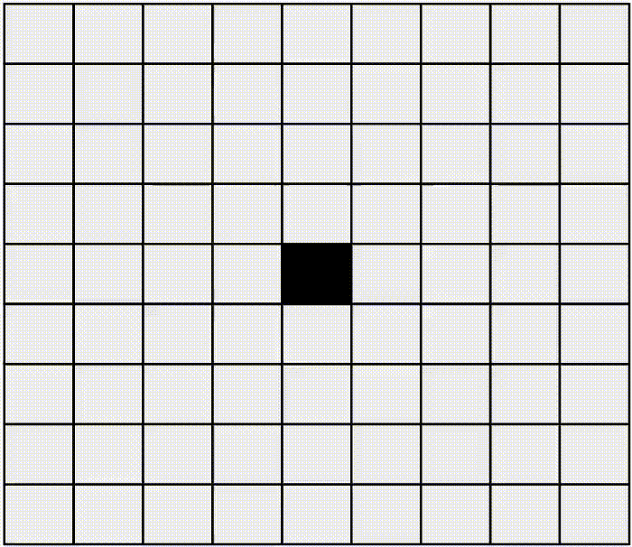
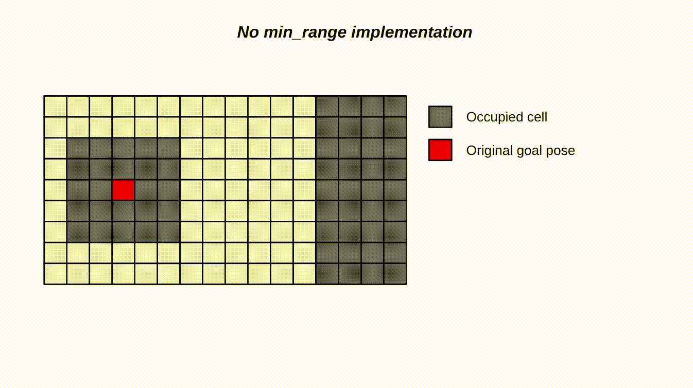
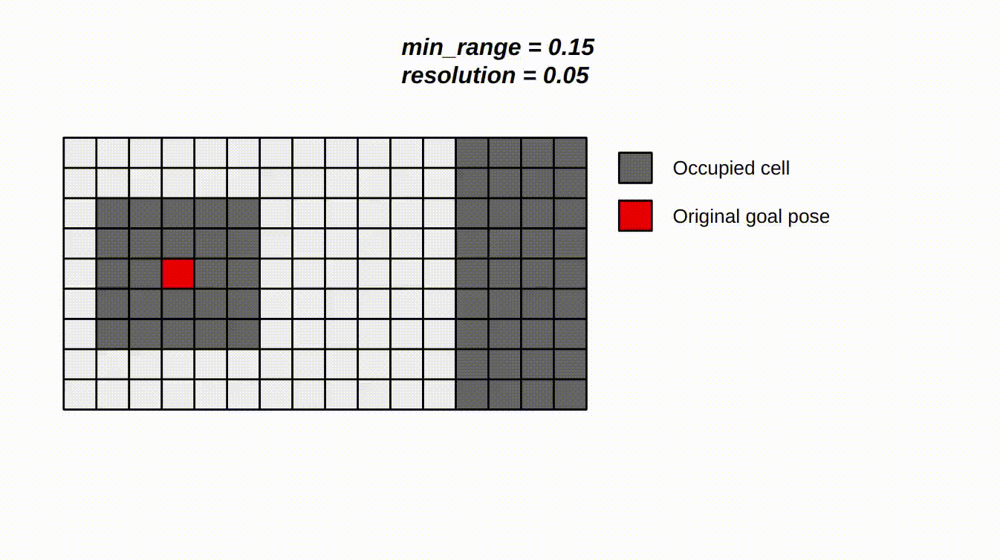

# Goal Validity Checker

During navigation, the <strong>Goal Validity Checker</strong> verifies the validity of goal positions.
To be considered valid, a goal must be located at an unoccupied cell and meet a specific minimum distance from any obstacles. The required distance is determined by the  [<strong>min_range</strong>](#configuration) parameter. In the case that the goal position is not valid, it will calculate a new valid goal pose within a defined range from the original goal. The defined range is determined by the [<strong>max_range_new_goal</strong>](#configuration) parameter.

The <strong>Goal Validity Checker</strong> has been tested on ROS 2 Galactic.

This feature was created by Jason Koubi while working as an intern for Karelics Oy.

# Table of Contents
- [Goal Validity Checker](#goal-validity-checker)
- [Table of Contents](#table-of-contents)
- [Usage Instructions](#usage-instructions)
    - [Using nav2](#using-nav2)
    - [Using service without behavior trees](#using-service-without-behavior-trees)
- [Configuration](#configuration)
- [How it works?](#how-it-works)
    - [Example 1: No min_range](#example-1-no-minrange)
    - [Example 2: min_range = 5cm](#example-2-minrange--5cm)
    - [Example 3: min_range = 15cm](#example-3-minrange--15cm)
- [Limitation](#limitation)
- [License](#license)


# Usage Instructions 

## Using nav2

In order to use the <strong>Goal Validity Checker</strong> for ROS 2 navigation purposes, we need to add the service into the behavior tree. This will require the following:
 - Add included (<strong>goal_checker_bt_node</strong>) behavior tree node into your behavior tree.
 - Add the <strong>goal_checker_bt_node</strong> to the <em>```bt_navigator```</em> parameter <em>```plugin_lib_names```</em> list.


<strong><em>Note</strong></em>: An example of a behavior tree can be found in the <strong>behavior_trees</strong> folder where the <strong>Goal Validity Checker</strong> is incorporated. This integration enables us to employ the <strong>Goal Validity Checker</strong> for nav2.
## Using service without behavior trees

The <strong>Goal Validity Checker</strong> node comprises a service named <strong>goal_checker_validity</strong> which takes a <strong>geometry_msgs/PoseStamped</strong> message as a request. The response is composed of 3 messages: a <strong>bool</strong> which will inform us if it has successfully found a valid goal pose, a <strong>string</strong> message indicating the resulting status and finally, a <strong>geometry_msgs/PoseStamped</strong> corresponding to the goal pose. 

```bash
geometry_msgs/PoseStamped goal_pose
---
bool success
string message
geometry_msgs/PoseStamped new_goal_pose
```

The service will report success:
- True - If the current goal is valid and within the defined range (also returns original goal)
- True - If a new valid goal was found within the defined range (returns new goal)
- False - If there was no valid goal found within the defined range (returns empty goal)
# Configuration

The Goal Validity Checker node is composed of various parameters which can be found in the <strong>goal_validity_checker.yaml</strong> parameter file. Here is a description of those parameters:


| Parameters | Description | Type | Default value |
| --- | --- | --- | --- | 
| free_thresh |  Threshold determining free occupancy cells in the global costmap | integer | 65 |
| max_range_new_goal | Maximum range allowed to search for a new goal pose | float | 2.0  |
| set_unknown_area_search | Enable or disable searching for valid goal pose if the original one is unknown  | bool | True |
| min_range | Checks if the goal pose is a minimum distance away from any obstacles | float | 0.1 |

<strong><em>Note</strong></em>: The unit of measurement for both the <strong>max_range_new_goal</strong> and the <strong>min_range</strong> is meters.

Can check parameters description using the following command:

```bash
ros2 param describe /goal_checker free_thresh
ros2 param describe /goal_checker max_range_new_goal
ros2 param describe /goal_checker set_unknown_area_search
ros2 param describe /goal_checker min_range
```

# How it works?

In order to understand what the code does, a visual explanation is carried out. First, the map is represented as a list of cells containing occupancy data corresponding to the presence or no of an obstacle at that corresponding cell.


Here is a gif illustrating the goal pose search method that we use if the original goal is on an occupied cell (represented in black).




As we can see, we are looking for neighboring cells starting with the right cell, then left, upper, and bottom (in green) and finally, we search in diagonal (in blue). If the new goal pose is still not found, we extend our search loop in the same order till we find a valid unoccupied cell.

## Example 1: No min_range

In this example, min_range = 0.0, we can see that a solution is found.



## Example 2: min_range = 5cm

Here, for min_range = 0.05, a solution is found.


## Example 3: min_range = 15cm

Finally, in this example, for min_range = 0.15, no solution is found.



# Limitation

This Goal Validity Checker has a limitation related to the planner.
It will <strong>not check if a path can be planned to this new goal pose</strong>. 
This means that it can find a valid goal pose but this might not guarantee that the robot will actually go to this position since it needs to calculate a plan to this valid goal pose in order to navigate.

# License

This piece of software is released under the GPL 3.0 license.

Goal Validity Checker - ROS 2 Node checking valid goal poses during navigation.

Copyright (C) 2023  Karelics Oy

This program is free software: you can redistribute it and/or modify
it under the terms of the GNU General Public License as published by
the Free Software Foundation, either version 3 of the License, or
(at your option) any later version.

This program is distributed in the hope that it will be useful,
but WITHOUT ANY WARRANTY; without even the implied warranty of
MERCHANTABILITY or FITNESS FOR A PARTICULAR PURPOSE.  See the
GNU General Public License for more details.

You should have received a copy of the GNU General Public License
along with this program. If not, see <https://www.gnu.org/licenses/>.